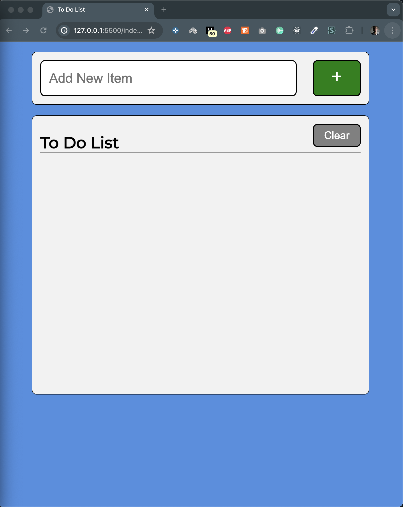
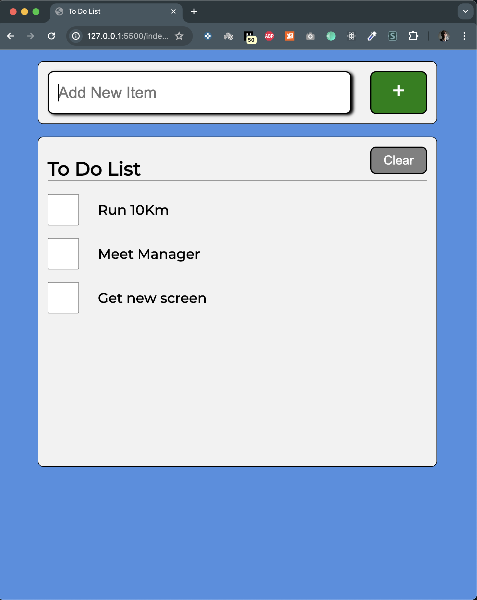
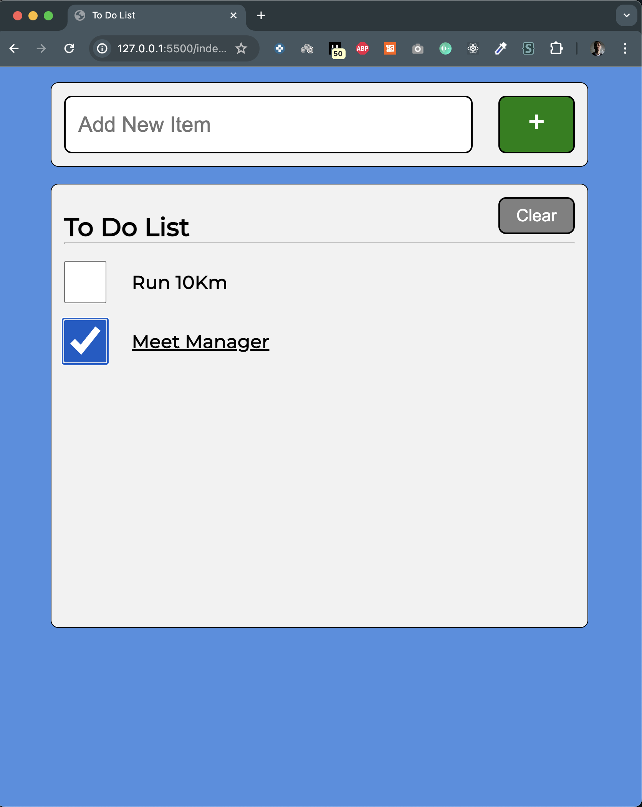

# Making Responsive Web App

This is by doing the course [Here](https://www.youtube.com/watch?v=y51Cv4wnsPw) with the great channel [FreeCodeCamp](https://www.youtube.com/@freecodecamp)

# Simple TODO List

It's a simple todo app that you can add and delete todos, power with local storage for constancy and making it responsive to get all the device sizes.

## Technologies Used

1. Html
2. CSS (SASS)
3. Javascript
4. LocalStorage

## Main Screen

## Add Todos

## Remove TODOS

